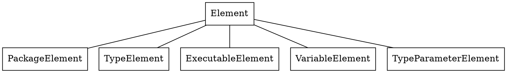
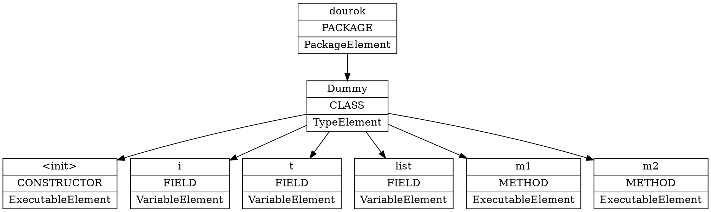
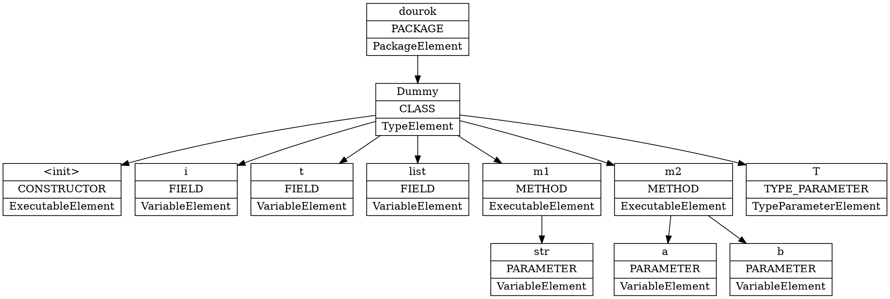
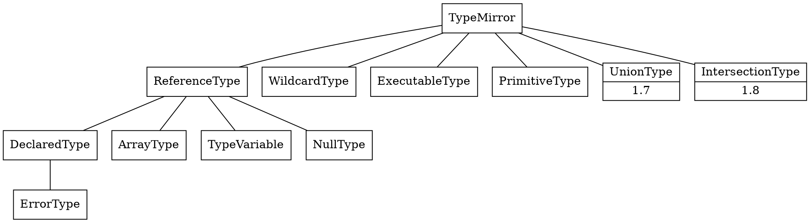

### Annotation Processor

创建一个注解处理器，需要继承 `AbstractProcessor`。`AbstractProcessor` 是抽象类，子类需要实现 ·process 方法。

    @SupportedAnnotationTypes("info.dourok.MyAnnotation") // 声明这个处理器需要处理的注解
    public class MyProcessor extends AbstractProcessor{
      @Override
      public boolean process(
          Set<? extends TypeElement> annotations,
          RoundEnvironment env) {
             // 
          }
    }

`process` 方法的返回值为 true 表示，当前注解处理器对其声明的注解类型是独占的，后续处理器不会再处理相同的注解。

同时还需在项目目录下创建文件 `resources/META-INF.services/javax.annotation.processing.Processor`，并在文件内写入自定义处理器的完整类名： package.name.MyProcessor

#### TypeElement

所有可供注解的类型都用 [Element][] 表示。[TypeElement][] 是其的子类，表示类或者接口类型。

传入 process 方法的 `Set<? extends TypeElement>` 表示当前处理器所需要处理的注解类型。

[Element]: https://docs.oracle.com/javase/7/docs/api/javax/lang/model/element/Element.html
[TypeElement]: https://docs.oracle.com/javase/7/docs/api/javax/lang/model/element/TypeElement.html

#### RoundEnviroment

[Processor (Java Platform SE 7 )](https://docs.oracle.com/javase/7/docs/api/javax/annotation/processing/Processor.html#process)

注解处理器的 `process` 方法是会调用多次的，因为处理注解的过程是会循环多次的，每次循环（round）可能会产生新的源文件，这些源文件就会再下次循环进行处理。[RoundEnvironment][] 就是提供每次循环的环境。
比如 `getRootElements` 就是获取当前环境所处理的根类型列表。`getElementsAnnotatedWith` 获取某个注解所注解的元素（element）。

每次循环的注解处理器还是同一个实例，注解处理器只会初始化一次，只有 `process` 才会在每个循环（round）调用一次。

[RoundEnvironment]: https://docs.oracle.com/javase/7/docs/api/javax/annotation/processing/RoundEnvironment.html

#### 其他

处理器编译的时候可能会有警告：

> 警告: 来自注释处理程序 'package.name.MyProcessor' 的受支持 source 版本 'RELEASE_6' 低于 -source '1.8'

这时可以覆盖，覆盖 `getSupportedSourceVersion` 让其返回最新版本。

    @Override public SourceVersion getSupportedSourceVersion() {
        return SourceVersion.latestSupported();
      }

也可以用注解支持的源码版本 `@SupportedSourceVersion(SourceVersion.RELEASE_8)`。如果没有注解 `AbstractProcessor#getSupportedSourceVersion` 就会返回 RELEASE_6，导致警告的发生。

同样的声明处理需要处理注解，可以用 `@SupportedAnnotationTypes`，也可以重写 `AbstractProcessor#getSupportedAnnotationTypes`

### Auto Service

[auto/README.md at master · google/auto](https://github.com/google/auto/blob/master/service/README.md)

一个用于自动生成 `resources/META-INF.services/javax.annotation.processing.Processor` 等等 service providers 的库。

    @AutoService(Processor.class)// 会自动生成 service provider 文件，可见注解还可以注解注解处理器
    final class MyProcessor implements Processor {
      // …
    }

### 再谈 Element

对于注解处理器来说，源代码都是数据，没有运行时的概念。同时源代码的组织方式是有结构的，而 Element 就是用来表示这种结构。Element 对应的就是 java 语法中用来表示层级的各种元素，可以通过下图一窥 java 中这些元素具体是什么：

首先是包（package），各种类文件（.java）是组织在包中的，同时类文件里面还定义了各种字段（变量）和方法（可执行的代码块）。整个项目的源码就可以用这种方式表示为一颗树。Element 的接口也体现了这一点：

    public interface Element extends AnnotatedConstruct {
      ...
      // 获取父元素
      Element getEnclosingElement();
    
      // 获取子元素列表
      List<? extends Element> getEnclosedElements();
      
      ...
    }

下面以 Dummy.java 为例，看一下注解处理器将其转换为什么样的 Element 树。

    package info.dourok;
    
    import java.util.List;
    
    /**
     * Created by tiaolins on 2017/8/26.
     */
    
    public class Dummy<T> {
      public int i;
      public T t;
      public List<Integer> list;
    
      public void m1(String str) {
        System.out.println(str);
      }
    
      public int m2(int a, int b) {
        int c = a + b;
        return c;
      }
    }

这图是通过 `Element#getEnclosedElements` 遍历后用 [graphviz-java][] 生成的。可以看到方法的参数和返回类型并不会通过 `EnclosedElements` 返回，参数列表是通过 `ExecutableElement#getParameters` 返回，而返回类型不会被当做 `Element` 而是一个 `TypeMirror`。至于类的类型参数，是通过 `getTypeParameters` 返回，包括方法的类型参数也是，他们两个 Element 都实现了  `Parameterizable`。

1.8 后参数类型也能被注解，见 [ElementType (Java Platform SE 8 )](https://docs.oracle.com/javase/8/docs/api/java/lang/annotation/ElementType.html#TYPE_PARAMETER)。所以，`public class Dummy<@MyAnnotation T>` 这样的语法是合法的。

[graphviz-java]: https://github.com/nidi3/graphviz-java

### TypeMirror

TypeMirror TypeElement 与 Class、Type 之间如何互相转换
